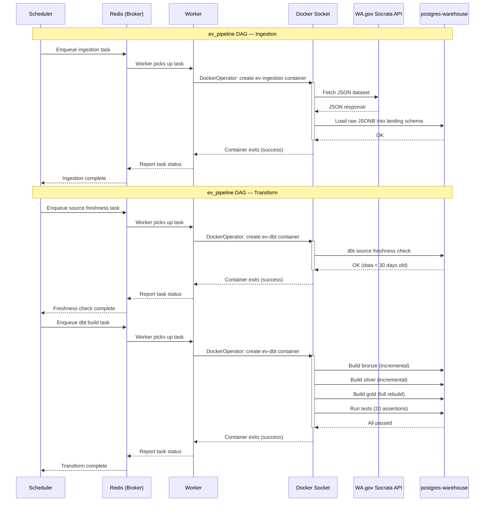

# Architecture

## Approach

An ELT pipeline that ingests electric vehicle registration data from Washington State's
open data portal, transforms it through a medallion architecture (Landing → Bronze → Silver → Gold),
and serves a star schema to Power BI.

Everything runs locally via Docker Compose. Airflow orchestrates the pipeline, launching ingestion
(Python) and transformation (dbt) as sibling Docker containers via DockerOperator.

## Challenges

I took this project as an opportunity to learn to setup things that at work they are either managed
by other teams or they were already there when I arrived.

### Where to run the code

Airflow provides a LocalExecutor that runs the code right there in the scheduler container, different
from the CeleryExecutor who sends the task for the worker. I definitely could have made it easier for
me and just use the LocalExecutor but I went with the CeleryExecutor.

Okay, so, the CeleryExecutor "runs" the code, what does that mean? Airflow shouldn't run that much, its
mostly for orchestration. In a cloud environment it would trigger Glue jobs, Databricks jobs, dbt jobs
(Operators) that actually ingest/transform the data. To simulate that I used the DockerOperator and created
images for the ingestion script to run and for the transformations to run.



### Where to store the data

Storing the data was unnecessary but in the real world the raw files would end up in a S3 bucket or some
blob storage, so I saved the raw data in the /data folder.

### Data

#### API - Socrata

Socrata JSON format — The API returns a non-standard format with column metadata and positional arrays
rather than key-value objects. The ingestion script maps column positions to field names before loading.

#### Registered vehicles per year / YoY change

Each row in the source data represents CURRENTLY registered vehicles, we cannot really answer how many vehi
cles are registered per year as we do not have historical data, only the current snapshot. Vehicles could
have been registered years ago but not anymore, we see the survivors.

The data did NOT have `updated_at` nor a `created_at` fields, which made it very annoying to try to answer
the questions posed by the challenge. I do NOT have the date/timestamp of registration, only the
model year of the cars. Needless to say this is not the same as the registration date as you can move into
the state with your old car, you can buy a used car from another state, etc.

The Socrata API does provide two metadata fields per row: `socrata_created_at` and `socrata_updated_at`.
I investigated `socrata_created_at` hoping it could serve as a registration date proxy, but all 271K rows
have the exact same value — it's just the bulk upload timestamp from when the dataset was published to the
portal. `socrata_updated_at` is more useful: it reflects when each row was last modified in the portal, so
I use it in the silver layer to pick the most recent version of each vehicle during deduplication.

I considered using `socrata_updated_at` as a proxy for registration date, but it only reflects when the
record was last modified in the portal — a field correction, an owner moving, or a dataset republish would
all change it. It says nothing about when the vehicle was actually registered.

I ended up using the model year as if it was the same as the registration year... they probably correlate,
in any case I wanted something to do the dashboard.

### Containers networking

Docker networking — Airflow-launched containers need to reach `postgres-warehouse` by hostname. Solved by
setting `network_mode` to the Compose network on DockerOperator tasks.

## Data Flow

```
WA.gov Socrata API (JSON)
        ↓
  Python ingestion
        ↓
  Landing schema — raw JSONB + ingestion metadata (append-only)
        ↓
  Bronze schema — typed columns extracted from JSONB (incremental)
        ↓
  Silver schema — deduplicated, one row per vehicle (incremental)
        ↓
  Gold schema — star schema: fact + 3 dimensions (full rebuild)
        ↓
  Power BI dashboard
```

## Tech Stack

| Component      | Technology         | Purpose                                    |
|----------------|--------------------|--------------------------------------------|
| Orchestration  | Apache Airflow     | Schedule and monitor pipeline tasks        |
| Ingestion      | Python             | Fetch JSON from Socrata API, load into PostgreSQL |
| Warehouse      | PostgreSQL         | Store data across all layers               |
| Transformation | dbt (dbt-postgres) | SQL-based transforms across medallion layers |
| Dashboarding   | Power BI           | Visualization and reporting                |
| Infrastructure | Docker Compose     | Container orchestration                    |

## Design Decisions

**ELT over ETL** — Load raw data first, transform inside the warehouse. Keeps ingestion simple and makes transformations auditable via dbt.

**Medallion architecture** — Landing (raw JSONB), Bronze (typed extraction), Silver (deduplicated), Gold (dashboard-ready). Each layer has a clear responsibility.

**Star schema in Gold** — The gold layer is modeled as a star schema with a fact table (`fact_ev_registrations`) and three dimensions (`dim_location`, `dim_vehicle`, `dim_utility`). Power BI works best with star schemas — it can auto-detect relationships and enables intuitive drag-and-drop analysis.

**Incremental materialization** — Bronze and Silver use `delete+insert` to avoid reprocessing historical batches. Gold is a full table rebuild since soft-delete detection is a global computation comparing each vehicle's timestamp against the latest batch.

**DockerOperator** — Airflow launches ingestion and dbt as sibling containers via Docker socket mount. Each task runs in an isolated environment with its own dependencies.

**Full-snapshot ingestion** — Every batch is a complete dump from the source. This enables soft-delete detection by comparing consecutive snapshots.

## Data Transformations

### Bronze (incremental)
- Extracts typed columns from landing JSONB (`value->>'field'` with casts)
- Generates a surrogate key via `dbt_utils.generate_surrogate_key(['dol_vehicle_id', 'el_batch_id'])`
- Only processes new batches based on `el_loaded_timestamp`

### Silver (incremental)
- Deduplicates bronze via `ROW_NUMBER() PARTITION BY dol_vehicle_id ORDER BY socrata_updated_at DESC, el_loaded_timestamp DESC`
- Only re-deduplicates vehicles that appear in new batches

### Gold — Intermediate (ephemeral)
- Filters silver to the latest batch only (soft-delete detection)
- Cleans `cafv_type` from verbose strings to `Eligible` / `Not Eligible` / `Unknown`
- Defaults empty `county` and `city` to `'Unknown'`
- Splits `geocoded_column` (WKT `POINT (lon lat)`) into `latitude` and `longitude`

### Gold — Star Schema (table)

| Model                    | Type      | Description                                                    |
|--------------------------|-----------|----------------------------------------------------------------|
| `fact_ev_registrations`  | Fact      | One row per vehicle. FKs to dimensions + `registration_count`  |
| `dim_location`           | Dimension | County, city, state, zip, district, census tract, lat/lon      |
| `dim_vehicle`            | Dimension | Make, model, year, EV type, CAFV eligibility, electric range   |
| `dim_utility`            | Dimension | Electric utility provider                                      |

All surrogate keys generated with `dbt_utils.generate_surrogate_key`. Referential integrity enforced via dbt relationship tests.

## Production Considerations

| Component      | This Project                       | Production Equivalent                                  |
|----------------|------------------------------------|--------------------------------------------------------|
| Orchestration  | Airflow on Docker Compose          | Managed Airflow (MWAA, Cloud Composer)                 |
| Ingestion      | DockerOperator (sibling container) | KubernetesPodOperator, AWS Glue, or serverless function |
| Warehouse      | PostgreSQL                         | Snowflake, BigQuery, Redshift, or Databricks           |
| Transformation | dbt in Docker container            | dbt Cloud, or dbt-core in CI pipeline                  |
| Dashboarding   | Power BI Desktop                   | Power BI Service, Looker, Tableau                      |
| Infrastructure | Docker Compose                     | Kubernetes with Terraform/Pulumi                       |
